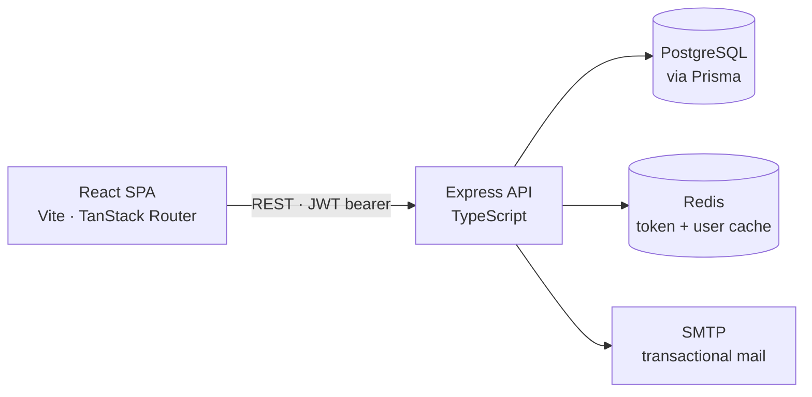

# OrphaCare

A child-welfare operations platform for the Nepal context. Adoption listings, adoption
requests, missing-child reports, donations, and verified field volunteers — in one
role-based system with admin oversight and an auditable trail on every sensitive record.

> **Status:** in active development. Built as a full-stack portfolio project.

---

## The problem

Child-welfare work in Nepal is coordinated over phone calls, paper files, spreadsheets and
social-media posts. Adoption requests are hard to compare and track, missing-child reports
arrive without structured last-seen data, donations get lost between pledge and delivery,
and volunteers act on behalf of an organisation without any identity check.

OrphaCare centralises those four workflows behind one permission model, so every sensitive
decision has a status, an owner, and a record of who made it.

## What it does

**Adoption.** Admins publish child profiles; the public can browse children awaiting
adoption. A registered user submits an adoption request, which moves through
`Pending → UnderReview → Approved | Rejected`, with `Cancelled` available to the applicant.
Approval is gated on a completed home survey and, once granted, marks the child adopted and
automatically rejects every competing request for that child.

**Missing-child reports.** Authenticated users file reports with the child's details,
last-seen address and time, geographic coordinates and a photo, then track and manage their
own reports.

**Donations.** Donors pledge money or physical goods — food, clothes, books — and follow
them through `Pending → Received | Rejected → Distributed` as admins update fulfilment.

**Volunteers and field tasks.** Users apply to volunteer and submit identity documents for
admin verification. Approved volunteers are assigned field tasks — adoption home surveys and
missing-child follow-ups — and submit findings that feed back into the adoption decision.

**Dashboards.** Users see their own requests, reports and donations. Admins see platform
activity and the queue of items awaiting a decision.

## Architecture



Two independent pnpm packages in one repository. The API is organised by feature, each one
following the same path:

```
route → Zod schema → controller → service → repository → Prisma
```

Routes declare middleware and Swagger docs, schemas validate and type the request,
controllers do HTTP translation only, services hold the business rules and transaction
boundaries, and repositories own soft-delete writes.

## Engineering highlights

**Concurrency-safe adoption approval.** Approving a request locks the child's row with
`SELECT … FOR UPDATE` and, inside a single transaction, marks the child adopted, approves the
winning request and rejects every competing one. Two admins approving rival requests for the
same child cannot both succeed.

**Constraints in the database, not just in code.** A partial unique index enforces
"one open adoption request per user" in Postgres, so the rule survives concurrent inserts
that an application-level check would miss.

**Soft delete as a Prisma client extension.** `deletedAt: null` is injected into every read
and update automatically; direct writes to `deletedAt` are rejected with a typed error; and
deletion or restoration goes through explicit repository helpers that cascade to related
records. Deleted data is never silently resurrected by a forgotten `where` clause.

**Declarative query building.** Each list endpoint declares its filters, ranges, searchable
paths and default sort as configuration, and a shared builder compiles that into Prisma
arguments. Ownership and soft-delete conditions are deliberately kept out of the builder and
stay in the services, where they can be reviewed.

**Schema-first validation.** One Zod schema per endpoint covers body, params, query and file
uploads, and its inferred type flows through the controller signature — so a schema change
becomes a compile error rather than a runtime surprise.

**Fail-fast configuration.** Environment variables are parsed and validated by Zod at boot
behind a singleton accessor, so a missing secret stops the process instead of surfacing as a
500 much later.

**Layered authorization.** Authentication, role checks and per-record ownership are three
separate concerns: middleware resolves the caller, `requireRole` gates the route, and the
service verifies that the caller actually owns the record.

## Tech stack

| | |
|---|---|
| **Backend** | Node.js, Express 5, TypeScript, Prisma 7, PostgreSQL, Redis, JWT, Zod, multer, nodemailer, Swagger, Biome |
| **Frontend** | React 19, Vite 7, TypeScript, TanStack Router, TanStack Query, Zustand, React Hook Form, Zod, Tailwind CSS 4, shadcn/Radix, axios |
| **Tooling** | pnpm, Vitest, GitHub Actions |

## Getting started

Requires Node.js 22+, pnpm, PostgreSQL, Redis, and SMTP credentials.

```bash
git clone https://github.com/manishkarki02/orphacare.git
cd orphacare

# API — http://localhost:8000
cd backend
pnpm install
cp .env.sample .env      # then fill in the values
pnpm prisma:generate
pnpm prisma:migrate
pnpm dev

# SPA — http://localhost:5173
cd ../frontend
pnpm install
pnpm dev
```

Interactive API documentation is served at `http://localhost:8000/api-docs`.

Per-package setup, environment variables and scripts:
[backend/README.md](backend/README.md) · [frontend/README.md](frontend/README.md)

## Repository layout

```text
backend/
  prisma/schema.prisma        Data model, enums, migrations
  src/app.ts                  Express setup, CORS, static uploads, error handling
  src/common/                 Middleware, shared utils, validation, response helpers
  src/config/                 Environment, multer, query, Swagger, mail
  src/db/                     Prisma client, soft-delete extension and repository
  src/features/               auth · kids · adoption · report · donation · task · volunteer
frontend/
  src/routes/                 TanStack Router file-based routes (routeTree.gen.ts is generated)
  src/features/               Feature-scoped API clients, types and components
  src/components/ui/          shadcn-style primitives
  src/hooks/                  Query and mutation wrappers
  src/lib/api.ts              axios instance with token refresh
  src/store/auth-store.ts     Persisted auth state
```

## A note on the domain

This project handles child photographs, the geolocation of missing children, and the personal
details of adopters, donors and volunteers. It is built on the assumption that such data is
sensitive by default: visibility is restricted rather than granted, contact details are never
exposed publicly, sensitive records are soft-deleted rather than destroyed, and every
consequential action is attributed to the account that took it.

## Author

Manish Karki — [GitHub](https://github.com/manishkarki02)
